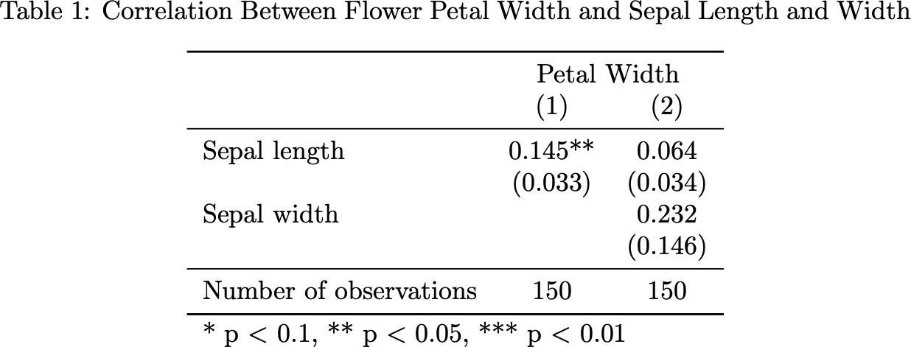

# Tables

This section introduces best practices for the presentation of tables in economics papers and explains the usage of functions that can generate formatted tables from R model objects. First, we give guidelines for table formatting adapted from the Journal of Political Economy's [manuscript preparation guide](journals.uchicago.edu/journals/jpe/prep-table). Second, we construct a publication-quality table using custom functions that can be downloaded [here](https://github.com/clandinq/ra_tools/blob/main/scripts/table_functions.R).

## Guidelines for table formatting

### Horizontal and vertical lines

-   **Only three horizontal lines.** Tables should be free of horizontal lines unless they indicate the structure of the data. All tables should have the three following horizontal lines:
    -   One under the title, above the column headings (LaTeX `\toprule`)
    -   One between the column headings and the body of the table (LaTeX `\midrule`)
    -   One at the bottom of the table (LaTeX `\bottomrule`)
-   **No vertical lines.** No vertical lines should be included in the table.

### Column headings

-   **Brief column names.** Column headings should identify the column as briefly as possible. Headings should contain any necessary symbols (%, \$, etc.) or measurement abbreviations (cm, kg, etc.) that apply to the data in the column below.

### Symbols

-   **No symbols in the table body.** The body of the table should be free of symbols or measurement abbreviations (e.g. %, USD).

-   **Symbols should be included next to dependent variable names.** Symbols should appear in the column head when they apply to all values in the column, or in the leftmost column when they apply to all values in a row.

    -   For example, balance tables where each row is a regression will include symbols in row headers; regression tables where each column is a regression will include symbols in column headers.

## An example using the `iris` dataset

The following sections show how to make a publication-quality table using the `iris` dataset.

### Two simple models using the `iris` dataset

First, we load the `iris` dataset that contains measurements of 4 attributes for 50 flowers from 3 different species.

```{r load_data, eval = TRUE, echo = TRUE}
pacman::p_load(here, tidyverse, magrittr, fixest, modelsummary, kableExtra, scales)
data(iris)
head(iris)
```

Then, we define two models using package `fixest`. Both contain species fixed effects and cluster their errors at the species level.

```{r mshow, eval = TRUE, echo = TRUE}
m1 <- feols(Petal.Width ~ Sepal.Length,
            fixef = "Species",
            cluster = "Species",
            data = iris)
m2 <- feols(Petal.Width ~ Sepal.Length + Sepal.Width, 
            fixef = "Species",
            cluster = "Species",
            data = iris)
```

#### `mshow`: **visualizing quickly regression outcomes**

Next, we introduce a function called **mshow** for visualizing quickly regression outcomes. This function is helpful when we want to quickly preview a model in R Studio's Viewer window instead of having to export the model to LaTeX. **mshow** defines standard significance levels and omits all statistics but the number of observations. The function takes as an input a list with the models (or a single model), and can include additional input that is passed on to the `modelsummary` function (for example, including additional rows).

```{r ms_opts, echo = FALSE}
mshow <- function(models, ...) { 
  modelsummary(models, 
               stars = c("*" = .1, "**" = .05, "***" = 0.01),
               gof_omit = "AIC|BIC|R2|R2 Adj.|R2 Pseudo|R2 Within|Log.Lik.|Std.Errors|FE|RMSE",
               ...)
}
model_list <- list(m1, m2)
mshow(model_list)
```

#### Exporting the table to LaTeX

We can export the previous table to latex with the following code:

```{r ms_export, eval = FALSE, echo = FALSE}
options("modelsummary_format_numeric_latex" = "plain")
current_table <- mshow(model_list, output = "latex")
current_table %>% 
  write(here("results", "tables", "table_1.tex"))
```

<center>{width="300"}</center>

The previous table is far from being ready to include in a paper: it does not specify what the outcome variable is, the default variable names have not been replaced by more descriptive names, and it includes content that is better left for the footnote (significance notes). The next thing that should be done to format the table is to adjust the table size and position, since both of these issues are fixed earlier on in the LaTeX code.

## Adjusting table size and position

The functions `float_here`, `adjust_box`, `adjust_height`, and `adjust_col_spacing` are used to adjust the table size and position:

-   `float_here` inserts the `[H]` option after `\begin{table}` so that LaTeX does not reposition the tables. This function requires including `\usepackage{float}` in the document preamble.
-   `adjust_box` reduces the size of the table so that it fits within the text column width. This function requires including `\usepackage{adjustbox}` in the document preamble.
-   `adjust_height` is used to adjust the *height* of a table. This is useful when dealing with long tables that may not fit within the same page without further adjustment. This limits the table to a user-defined text height percentage (e.g. 70% of the text height). `adjust_height` requires the previous application of the `adjust_box` function.
-   `str_insert` is an auxiliary function used to insert lines in tables.
-   `adjust_col_spacing` defines column spacings. This can be used to increase the spacing between columns when a table looks cramped.

**Functions**:

```{r table_adjust_fun, eval = FALSE, echo = TRUE}
float_here <- function(table) {
  if (!suppressWarnings(str_detect(string = table, 
                                   pattern = fixed("\\begin{table}[H]")))) {
    table %<>%
      str_replace(pattern = fixed("\\begin{table}"), 
                  replacement = "\\begin{table}[H]")
  }
  return(table)
}

adjust_box <- function(table) {
  table %>% 
    str_replace(pattern = fixed("\\begin{tabular"),
                replacement = "\\adjustbox{max width=\\textwidth}{ \n \\begin{tabular") %>% 
    str_replace(pattern = fixed("\\end{tabular}"),
                replacement = "\\end{tabular}}")
}

adjust_height <- function(table, height) {
  table %>% 
    str_replace(pattern = fixed("\\adjustbox{max width=\\textwidth}"),
                replacement = str_c("\\adjustbox{max totalheight=", height, 
                                    "\\textheight, max width=\\textwidth}"))
}

str_insert <- function(table, pattern, insert, before = FALSE) {
  rep <- ifelse(before,
                str_c(fixed(insert), "\n", fixed(pattern)),
                str_c(fixed(pattern), "\n", fixed(insert)))
  table %>% 
    str_replace(pattern = fixed(pattern),
                replacement = rep)
}

adjust_col_spacing <- function(table, spacing) {
  table %>% 
    str_insert(pattern = "\\centering",
               insert = str_c("\\setlength{\\tabcolsep}{", spacing, "pt}"))
}
```

**Usage**:

```{r table_adjust_use, eval = FALSE, echo = TRUE}
current_table %>% 
  float_here() %>% 
  adjust_box() %>% 
  adjust_height(0.7) %>% 
  adjust_col_spacing(16) %>% 
  write(here("results", "tables", "table_2.tex"))
```

<center>{width="389"}</center>

The effects of `float_here`, `adjust_box`, and `adjust_height` can only be seen when compiling the table. The wide column spacing specified by `adjust_col_spacing` can be observed when comparing with the previous table.

## Updating variable names and adding a caption and label

### Updating independent variable names

To update independent variable names, you should define object called `coef_names` with the detailed independent variable names, and names equal to the original variable names (example beow). `coef_map = coef_names` is passed on to `modelsummary`, substituting the original variable names.

```{r update_names, eval = FALSE, echo = TRUE}
coef_names <- c("Sepal length", "Sepal width") %>% 
  set_names(c("Sepal.Length", "Sepal.Width"))
current_table <- mshow(model_list, 
                       coef_map = coef_names,
                       output = "latex")
current_table %>%
  write(here("results", "tables", "table_3.tex"))
```

<center>{width="300"}</center>

### Adding dependent variable names and model numbers

The next step is to add dependent variable names and model numbers to the table. This can be done with function `insert_col_numbers`. The auxiliary function `get_num_cols` is defined later in this section.

`insert_col_numbers` has a binary toggle (TRUE includes column numbers, FALSE omits them) so that the function can be included inside other functions. That way, column numbers can be inserted depending on the number of columns.

**Function**:

```{r add_depvar_mnum_fun, eval = FALSE, echo = TRUE}
insert_col_numbers <- function(table, col_numbers) {
  if (col_numbers) {
    table %>% 
      str_insert(pattern = "\\midrule",
                 insert = str_c("& ", paste(str_c("(", 1:get_num_cols(table), ")"), collapse = " & "), "\\\\"),
                 before = TRUE) 
  } else {
    table
  }
}
```

**Usage**:

To update dependent variable names, you should set the names of the list with the models equal to the dependent variable names. Then, you can apply the `insert_col_numbers` function to include column numbers:

```{r add_depvar_mnum_use, eval = FALSE, echo = TRUE}
current_table <- model_list %>% 
  set_names(c("Petal width", "Petal width")) %>% 
  mshow(coef_map = coef_names,
        output = "latex")
current_table %>%
  insert_col_numbers(col_numbers = TRUE) %>% 
  write(here("results", "tables", "table_4.tex"))
```

<center>{width="297"}</center>

### Adding a multicolumn title

An alternative to the previous table is to add a multicolumn title that describes the dependent variable. This can be done with function `multicol_title`, which takes as an input the multicolumn title and has an option to add a horizontal line below the multicolumn title.

The auxiliary function `remove_names` removes the stock model names to keep only the multicolumn title. Therefore, the model list should remain unnamed. This function depends on another auxiliary function, `get_num_cols`, which calculates the numbers of columns in the table.

**Functions**:

```{r add_multicol_fun, eval = FALSE, echo = TRUE}
multicol_title <- function(table, title, cline = FALSE) {
  proc_table <- table %>% 
    str_insert(pattern = "\\toprule",
               insert = str_c("& \\multicolumn{", get_num_cols(table), "}{c}{", title, "} \\\\\n%clh"))
  if (cline) {
    proc_table %<>% 
      str_replace(pattern = "%clh",
                  replacement = str_c(fixed("\\\\cline{2-"), get_num_cols(table) + 1, "}"))
  }
  return(proc_table)
}

remove_names <- function(table) {
  if (str_detect(table, "Model 1")) {
    table %>% 
      str_replace(pattern = fixed(str_c("& ", str_c("Model ", 1:get_num_cols(table), collapse = " & "), "\\\\\n")),
                  replacement = "")
  } else {
    table
  }
}

get_num_cols <- function(table) {
  pos_start <- str_locate(table, fixed("tabular}[t]{"))[2] + 1 # Get starting position of column alignment
  pos_end <- str_sub(table, pos_start, pos_start + 15) %>%     # Extract end position
    str_locate(fixed("}"))
  pos_end <- pos_end[1] + pos_start - 2
  col_num <- (str_sub(table, pos_start, pos_end) %>% str_length()) - 1 # Exclude leftmost column
  return(col_num)
}
```

**Usage**:

Remember not to name the model list when using a multicolumn title:

```{r add_multicol_use, eval = FALSE, echo = TRUE}
current_table <- model_list %>% 
  mshow(coef_map = coef_names,
        output = "latex")
current_table %>%
  remove_names() %>% 
  multicol_title("Petal Width") %>% 
  insert_col_numbers(col_numbers = TRUE) %>% 
  write(here("results", "tables", "table_5.tex"))
```

<center>{width="267"}</center>

### Adding a caption and title to the table

`add_caption_label_center` is used to add a caption to the table float and define the float label. The caption should be as concise as possible, and the float should have the file name as label to facilitate locating the table in the paper and results folders. This function also centers the table in the middle of the float. `float_here` is required before `add_caption_label_center`.

**Functions**:

```{r add_caption_label_fun, eval = FALSE, echo = TRUE}
add_caption_label_center <- function(table, caption, label) {
  center <- ifelse(str_detect(table, "centering"), "", "\\centering")
  table %>% 
    str_insert(pattern = "\\begin{table}[H]",
               insert = str_c("\\caption{", caption, "} \n",
                              "\\label{tab:", label, "}", center))
}
```

**Usage**:

```{r add_caption_label_use, eval = FALSE, echo = TRUE}
current_table %>% 
  float_here() %>% 
  remove_names() %>% 
  multicol_title("Petal Width") %>% 
  insert_col_numbers(col_numbers = TRUE) %>% 
  add_caption_label_center(caption = "Correlation Between Flower Petal Width and Sepal Length and Width",
                           label = "flower_table") %>% 
  write(here("results", "tables", "table_6.tex"))
```

<center>{width="525"}</center>

## Final table formatting

### Updating the number of observations

Two functions can help to update the number of observations:

-   `comma_numobs` inserts a comma every three digits in the number of observations. The auxiliary function `comma_format` is used by this function.

-   `replace_numobs` replaces "Num.Obs" with a custom text (e.g. "Number of observations" or "Number of firms").

**Functions**:

```{r update_nobs_fun, eval = FALSE, echo = TRUE}
comma_format <- function(x, override_right_digits = NA) {
  # Calculate number of right digits
  if (x <= 0) {num <- 1} else {num <- x}
  right_digits <- 3 - floor(log10(abs(num)))
  if (right_digits < 0) {right_digits <- 0}
  if (right_digits > 3) {right_digits <- 3}
  if (!is.na(override_right_digits)) {right_digits <- override_right_digits}
  # Calculate number of left digits
  left_digits <- 4 + floor(log10(abs(num)))
  if (left_digits <= 0) {left_digits <- 1}
  # Format number
  proc_num <- format(round(x, right_digits), nsmall = right_digits, digits =  left_digits, big.mark = ",")
  if (proc_num != "0" & as.numeric(str_replace(proc_num, fixed(","), "")) < 1) {
    proc_num <- str_pad(proc_num, right_digits + 2, "right", "0")
  }
  return(proc_num)
}

comma_numobs <- function(models) {
  model_proc <- models
  for (i in 1:length(model_proc)) {
    model_proc[[i]]$nobs <- comma(model_proc[[i]]$nobs)
  }
  return(model_proc)
}

replace_numobs <- function(table, text) {
  table %>% 
    str_replace(pattern = "Num.Obs.",
                replacement = text) %>% 
    str_replace(pattern = "Num. Obs.",
                replacement = text)
}
```

**Usage**:

```{r update_nobs_use, eval = FALSE, echo = TRUE}
current_table <- model_list %>% 
  comma_numobs() %>% 
  mshow(coef_map = coef_names,
        output = "latex")
current_table %>% 
  float_here() %>% 
  remove_names() %>% 
  multicol_title("Petal Width") %>% 
  insert_col_numbers(col_numbers = TRUE) %>% 
  add_caption_label_center(caption = "Correlation Between Flower Petal Width and Sepal Length and Width",
                           label = "flower_table") %>% 
  replace_numobs("Number of observations") %>% 
  write(here("results", "tables", "table_7.tex"))
```

<center></center>

### Inserting additional data rows

Often it's useful to insert additional rows with statistics, for example means and medians. You can feed `modelsummary` a dataframe with the desired content and add these rows below the number of observations.

**Example:**

```{r insert_add_rows, eval = FALSE, echo = TRUE}
# Define additional rows
petal_mean <- mean(iris$Petal.Width) %>% comma_format()
sepal_length_mean <- mean(iris$Sepal.Length)  %>% comma_format()
sepal_width_mean <- mean(iris$Sepal.Width) %>% comma_format()
add_row <- data.frame(rbind(c("Mean petal width", rep(petal_mean, 2)),
                            c("Mean sepal length", rep(sepal_length_mean, 2)),
                            c("Mean sepal width", rep(sepal_width_mean, 2))))
# Add rows to previous table
current_table <- model_list %>% 
  comma_numobs() %>% 
  mshow(coef_map = coef_names,
        add_rows = add_row,
        output = "latex")
current_table %>% 
  float_here() %>% 
  remove_names() %>% 
  multicol_title("Petal Width") %>% 
  insert_col_numbers(col_numbers = TRUE) %>% 
  add_caption_label_center(caption = "Correlation Between Flower Petal Width and Sepal Length and Width",
                           label = "flower_table") %>% 
  replace_numobs("Number of observations") %>% 
  write(here("results", "tables", "table_8.tex"))
```

<center>{width="525"}</center>

### Distributing coefficient names over two rows

Interactions of variables frequently generate excessively long variable names. One solution for this is to split the variable name in two and put the second part of the variable name in the next row. Function `coef_two_rows` can do this automatically; all this needs is for the interaction variable to include "times" between the two variables.

**Functions**:

```{r coef_two_rows_fun, eval = FALSE, echo = TRUE}
coef_two_rows <- function(table) {
  # Check number of string locations
  string_loc <- str_locate_all(table, "times")[[1]]
  num_locations <- nrow(string_loc)
  # Generate temporary output
  output <- table
  # Tag words
  tagged_string <- "REPtimes"
  output %<>% str_replace_all("times", tagged_string)
  # Loop over string locations
  for (i in 1:nrow(string_loc)) {
    # Locate coefficient string to replace with ""
    pat_loc <- str_locate(output, fixed(tagged_string))[1]
    # Locate lower row to replace with coefficient string
    upper_row <- str_sub(output, pat_loc, str_length(output))
    lower_row <- upper_row %>% 
      str_sub(str_locate(upper_row, fixed("\\\\\n "))[2] + 1, str_length(upper_row))
    # Define pattern to replace in upper row
    pat_rep_upper <- str_split(upper_row, "&", n = 2)[[1]][1]
    # Define pattern to replace in lower row
    pat_rep_lower <- lower_row %>% 
      str_sub(1, str_locate(lower_row, fixed("\\\\\n"))[2])
    # Replace strings in table.
    output %<>%
      str_replace(pattern = pat_rep_upper,
                  replacement = "") %>% 
      str_replace(pattern = fixed(pat_rep_lower),
                  replacement = str_c("\\quad $\\times$", 
                                      str_replace(pat_rep_upper, tagged_string, ""),
                                      pat_rep_lower))
  }  
  return(output)
}
```

**Usage**:

```{r coef_two_rows_use, eval = FALSE, echo = TRUE}
# Add new variable to dataset.
set.seed(123)
current_data <- iris %>%
  mutate(random = sample(0:1, nrow(.), replace = TRUE))

# Define model
m3 <- feols(Petal.Width ~ Sepal.Length * random,
            fixef = "Species",
            cluster = "Species",
            data = current_data)

# Define coefficient names
coef_names <- c("Sepal length", "Random variable", "Sepal length times Random variable") %>%
  set_names(c("Sepal.Length", "random", "Sepal.Length:random"))

# Export table
current_table <- model_list %>% 
  append(list(m3)) %>% 
  comma_numobs() %>% 
  mshow(coef_map = coef_names,
        output = "latex")
current_table %>% 
  float_here() %>% 
  remove_names() %>% 
  multicol_title("Petal Width") %>% 
  insert_col_numbers(col_numbers = TRUE) %>% 
  add_caption_label_center(caption = "Correlation Between Flower Petal Width and Sepal Length and Width",
                           label = "flower_table") %>% 
  replace_numobs("Number of observations") %>% 
  coef_two_rows() %>%
  write(here("results", "tables", "table_9.tex"))
```

<center>{width="525"}</center>

### Inserting space between variables

In tables with two-line variable names, it can be easier to read the table when there is sufficient spacing between each set of variable coefficient and standard errors. The function `add_line_space` inserts vertical space between each set of variable numbers and facilitates reading the table.

**Function**:

```{r add_line_fun, eval = FALSE, echo = TRUE}
add_line_space <- function(table) {
  # Keep split rows after first parentheses.
  keep_after_firstpar <- (table %>% 
                            str_sub(str_locate(table, fixed("("))[1], str_length(table)) %>% 
                            str_split("\\\n"))[[1]]
  # Keep rows with parentheses.
  keep_after_firstpar <- keep_after_firstpar[str_detect(keep_after_firstpar, fixed("("))]
  # Drop first one (column numbers)
  keep_after_firstpar <- keep_after_firstpar[2:length(keep_after_firstpar)]
  # Replace with spacing.
  proc_table <- table
  for (i in 1:length(keep_after_firstpar)) {
    proc_table %<>%
      str_replace(pattern = fixed(keep_after_firstpar[i]),
                  replacement = str_c(keep_after_firstpar[i], "[0.3cm]"))
  }
  return(proc_table)
}
```

**Usage**:

```{r add_line_use, eval = FALSE, echo = TRUE}
current_table %>% 
  float_here() %>% 
  remove_names() %>% 
  multicol_title("Petal Width") %>% 
  insert_col_numbers(col_numbers = TRUE) %>% 
  add_caption_label_center(caption = "Correlation Between Flower Petal Width and Sepal Length and Width",
                           label = "flower_table") %>% 
  replace_numobs("Number of observations") %>% 
  coef_two_rows() %>%
  add_line_space() %>% 
  write(here("results", "tables", "table_10.tex"))
```

<center>{width="451"}</center>

## Putting it all together

### Combining everything into one simple function

Most of the previous tables can be combined into one simple function: `gen_base_table`. The only non-auxiliary functions that are not included by default in the options are `adjust_height`, `adjust_col_spacing`, `coef_two_rows` and `add_line_space`.

**Function**:

```{r gen_base_fun, eval = FALSE, echo = TRUE}
gen_base_table <- function(models, caption, label, title = NULL, cline = FALSE, coef_names, numobs = "Number of observations", ...) {
  # Get length of model. If large, it is a regression that needs to be put in a list
  if (length(models) > 10) {models <- list(models)}
  # Generate table
  output <- models %>% 
    # Fix number of observation number format
    comma_numobs() %>% 
    # Generate table with modelsummary
    modelsummary(coef_map = coef_names,
                 stars = c("*" = .1, "**" = .05, "***" = 0.01),
                 gof_omit = "AIC|BIC|R2|R2 Adj.|R2 Pseudo|R2 Within|Log.Lik.|Std.Errors|FE|RMSE",
                 escape = FALSE,
                 output = "latex",
                 ...) %>%
    # Insert float here option
    float_here() %>% 
    # Insert adjustbox
    adjust_box() %>% 
    # Add caption and label
    add_caption_label_center(caption = caption,
                             label = label) %>% 
    # Insert column numbers
    insert_col_numbers(ifelse(length(models) == 1, FALSE, TRUE)) %>% 
    # Remove model names if no unique column names given
    remove_names() %>% 
    # Replace number of observations (Num.Obs. with Num. Obs.)
    replace_numobs(numobs)
  if (!is.null(title)) {
    output %<>% multicol_title(title, cline = cline)
  }
  return(output)
}
```

**Usage**:

You can replicate the previous table with this simple command:

```{r gen_base_use, eval = FALSE, echo = TRUE}
model_list %>% 
  append(list(m3)) %>% 
  gen_base_table(caption = "Correlation Between Flower Petal Width and Sepal Length and Width",
                 label = "flower_table",
                 title = "Petal Width",
                 coef_names = coef_names) %>% 
  coef_two_rows() %>% 
  add_line_space() %>% 
  write(here("results", "tables", "table_11.tex"))
```

<center>{width="451"}</center>

### Adding footnotes

The final step is to remove the notes from the bottom of the table and include our own footnote. You can do this with function `format_save_footnote` and including `options("modelsummary_stars_note" = FALSE)` in your code. This function saves a footnote to a file with the same name as the table in the folder /results/notes. This makes it easier to locate notes and include them in the LaTeX document the following way:

```{r example, eval = FALSE, echo = TRUE}
\input{../results/tables/current_table.tex}
\input{../results/notes/current_table.tex}
```

**Usage**

**Function**:

```{r footnote_fun, eval = FALSE, echo = TRUE}
format_save_footnote <- function(text = "", filename, stars = FALSE) {
  sig <- ifelse(stars, " * $p < 0.1$, ** $p < 0.05$, *** $p < 0.01$.", "")
  footnote <- str_c("\\footnotesize \n", 
                    "\\begin{justify} \n",
                    "\\emph{Note}: ", text, sig, "\n",
                    "\\end{justify} \n",
                    "\\normalsize \n")
  clean_filename <- str_split(filename, fixed("."))[[1]][1]
  write(footnote, here("results", "notes", str_c(clean_filename, ".tex")))
}
```

**Usage**:

```{r footnote_use, eval = FALSE, echo = TRUE}
options("modelsummary_stars_note" = FALSE)
# (generate previous table after running this line)

paste("This table reports the correlation between petal width and sepal lenght and width.",
      "The unit of observation is at the plant level.",
      "The coefficients come from the regression of petal width on sepal length (column (1)), the regression of petal width on sepal length and sepal width (column (2)), and the regression of petal width on a random dummy variable, sepal length and the interaction between these two variables (column (3)).",
      "Data comes from the iris dataset.",
      "All estimations include species fixed effects, and standard errors clustered at the species level are included in parentheses.") %>% 
  format_save_footnote("current_table.tex", stars = TRUE)
```

<center>{width="451"}</center>

## Preparing tables for presentations

Once you have generated a final version of the table, there are a few functions that can easily generate a presentation version of the table, remove unwanted rows and add short notes at the bottom of the table.

### Generating presentation versions of tables

Presentation versions of tables only include the content between `\begin{tabulate}` and `\end{tabulate}`. `convert_save_pres_table` can do this conversion rapidly. By default, this table looks for the input table in /results/tables, and saves the output to the same folder with the *pres\_* prefix.

**Function**:

```{r pres_fun, eval = FALSE, echo = TRUE}
convert_save_pres_table <- function(table_name, table_path = here("results", "tables"), output_path = here("results", "tables")) {
  table <- read_file(here(table_path, table_name))
  table <- str_sub(table,
                   str_locate(table, fixed("\\begin{tabular}"))[1],
                   str_locate(table, fixed("\\end{tabular}"))[2])
  pres_table_name <- str_c("pres_", table_name)
  write(table, here(output_path, pres_table_name))
  print(str_c("Presentation table saved to",
              str_remove(output_path, here()), "/", pres_table_name))
}
```

**Usage**:

```{r pres_use, eval = FALSE, echo = TRUE}
convert_save_pres_table("table_11.tex")
```

### Removing standard errors and column numbers

Removing standard errors and column numbers can make it easier to fit tables in presentations without having to reduce the font size too much. `remove_std_errors_col_nums` is another simple function with no options that can quickly perform this modification.

**Function**:

```{r remove_fun, eval = FALSE, echo = TRUE}
remove_std_errors_col_nums <- function(table) {
  table %>%   
    str_split("\n") %>% 
    .[[1]] %>% 
    .[!(str_detect(., fixed("(")))] %>% 
    str_c(collapse = "\n")
}
```

**Usage**:

This would require saving a version of the original table without standard errors and column numbers, and then converting to a presentation version. The previous table would look like this:

```{r remove_use, eval = FALSE, echo = TRUE}
read_file(here("results", "tables", "table_12.tex")) %>% 
  remove_std_errors_col_nums() %>% 
  write(here("results", "tables", "table_13.tex"))
convert_save_pres_table("table_13.tex")
```

\###

<center>{width="462"}</center>

### Adding notes

Finally, although it's best practice not to add notes directly to a table, it is the only way you can add a note to a presentation table (since footnotes can't be included). `add_note` can be used for adding notes to presentation tables.

**Function**:

```{r add_fun, eval = FALSE, echo = TRUE}
add_note <- function(table, note) {
  table %>% 
    str_insert(pattern = "\\bottomrule",
               insert = str_c("\\multicolumn{", get_num_cols(table) + 1, "}{c}{", note, "}"))
}
```

**Usage**:

```{r add_use, eval = FALSE, echo = TRUE}
read_file(here("results", "tables", "pres_table_13.tex")) %>% 
  add_note("Quick note at the bottom of the presentation table.") %>% 
  write(here("results", "tables", "table_14.tex"))
```

\###

<center>{width="462"}</center>
